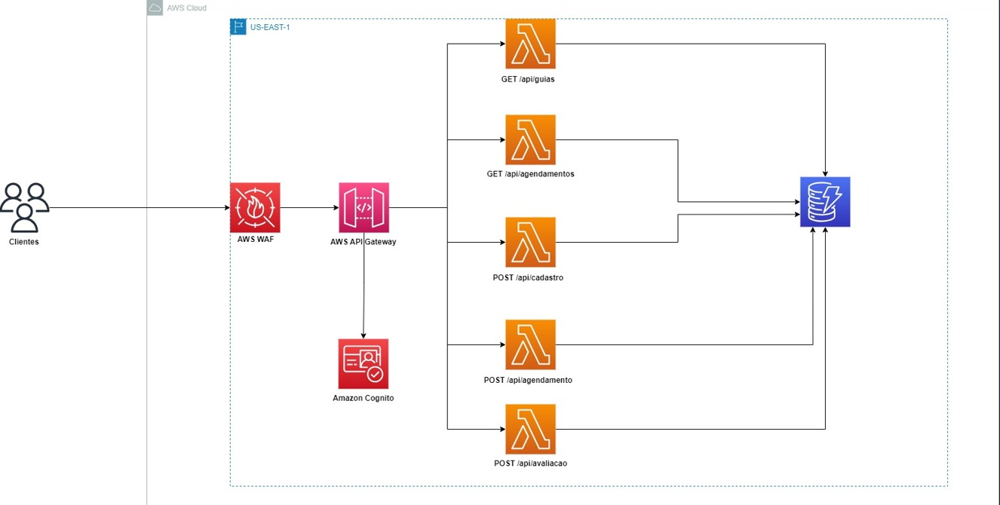

## Desenho solução

## Como validar implementação

1) Criar toda infra na AWS com o código terraform
2) Acessar o console da AWS e criar um usuário Cognito

### Recursos criado na AWS
1 - Cognito
2 - Bucket
3 - Dynamo

### Lista de comandos terraform
terraform init
terraform plan
terrafom apply --auto-approve
terraform destroy